# NERCMS TEST
## 17级计科-康楷晨

> 文档说明：在一边尝试一边记录的过程中，我对下面三个问题编写的格式都是——*过程+结论*——的形式，如果只要看结论的话，每个问题最后一点说明就是该问题我所得出的结论。

## 1. LAS文件中 *POINT DATA RECORD FORMAT 0* 和 *POINT DATA RECORD FORMAT 2* 间的差异

1. 对于这个问题，首先了解了LIDAR系统以及LAS格式的基本信息，LAS标准问题阅读的是`LAS Specification 1.4 - R15`说明书[*在这个过程中我阅读的是0-20页，后来看到20页发现这个问题的答案只有一句话……*]

2. *POINT DATA RECORD FORMAT 0* 和 *POINT DATA RECORD FORMAT 2*最大的区别就是格式2里面增加了表示RGB的三个颜色通道位，用于显示点的着色，各占2 Bytes位

## 2. Ubuntu 18.04环境下配置libLAS，并确定你配置的 libLAS 头文件 liblas.hpp 的 路径

### 配置环境这里使用的是Ubuntu18.04（当时加入小组群较晚，直接在自己的已有系统上进行配置了），下面对出现的一小部分问题以及最终结果进行记录

1. cmake
   - 在配置过程中没有使用make而使用cmake，由于在解压了libLAS-1.8.1之后看到里面并不是用makefile作为代码组织和编译方式的，而是采用了CMakeList.txt进行组织的，故使用cmake进行，通过对cmake进行简单阅读后看到了cmake较于makefile的优势，更加自动化、可跨平台而且上层。
  
   - 安装cmake，当时系统里面是没有安装cmake的[大致看了一下liaLAS的CMakeList.txt，发现最低cmake版本为2.6.0]
   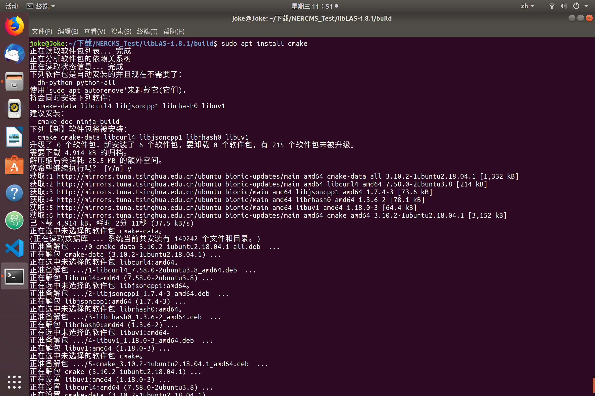

   - 进行这个库的编译工作，在此需要注意的是：通过阅读，我了解到如果直接在该目录下进行编译，那么会将所有生成的中间文件和源代码混在一起，而且cmake生成的makefile无法跟踪所有的中间文件，即无法使用”make distclean”命令将所有的中间文件删除。**所以我在内部建立了build文件夹，在该目录下进行编译的工作**。
   

   - 编译项目到build文件夹下：  `cmake ..`
   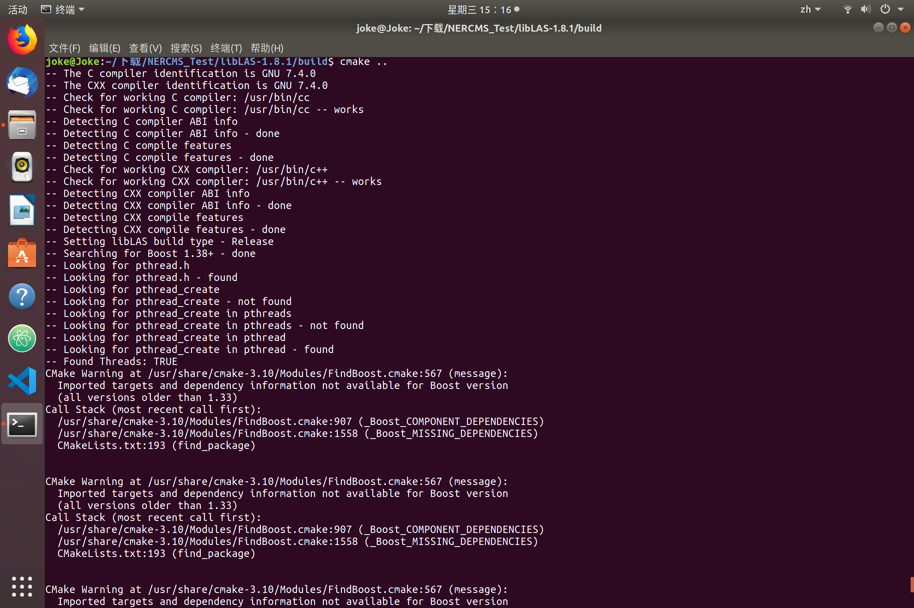
   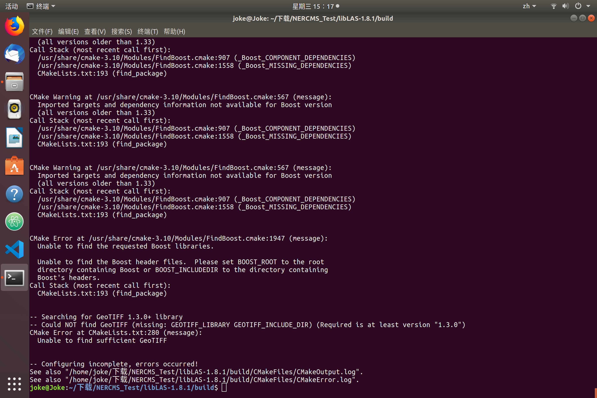

   - 首次cmake后出现了一些问题，看了报错信息是由于在进行libLAS库的使用前，需要安装Boost和GeoTIFF依赖库，故现在需要对其进行安装。
   - `wget -O boost_1_69_0.tar.gz http://sourceforge.net/projects/boost/files/boost/1.69.0/boost_1_69_0.tar.gz/download`
   - `wget https://download.osgeo.org/geotiff/libgeotiff/libgeotiff-1.3.0.tar.gz`
   - 配置GeoTIFF时又出现了TIFF库没有的情况，需要再次添加新的依赖库

   - 之后都是简单的进行配置、编译(过程太多，编译太慢，不做叙述)，都完毕后重新cmake libLAS进行编译
   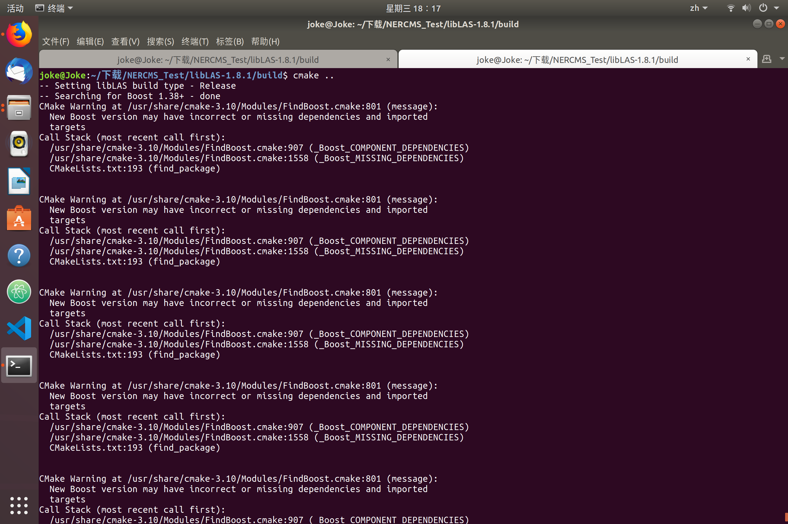
   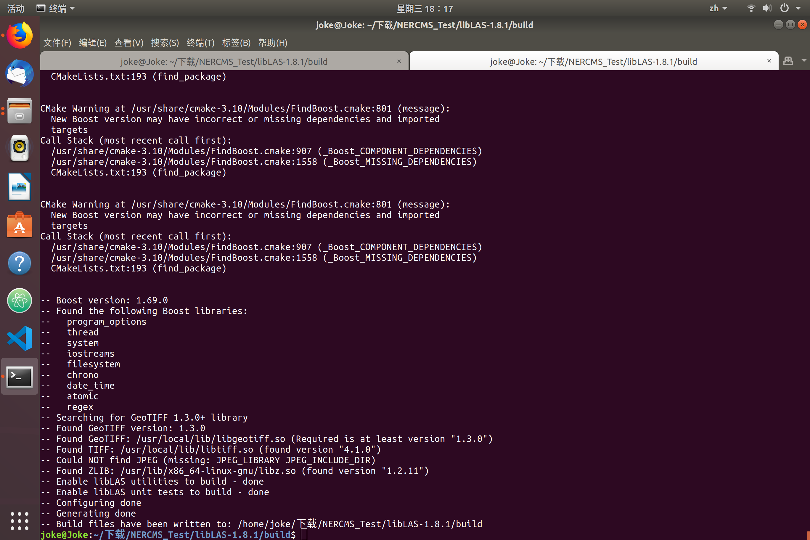

2. cmake完毕之后就生成了一般的Makefile文件，后面正常make编译、make install安装即可（非常慢、并且还需要管理员权限）
   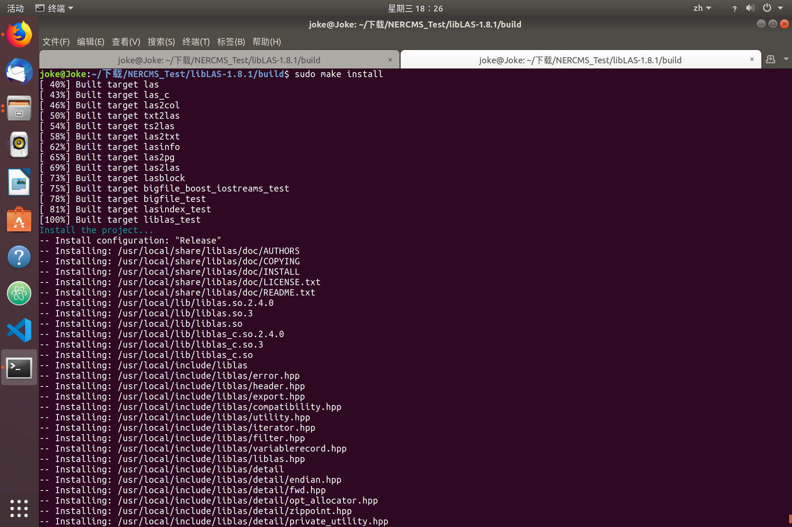
   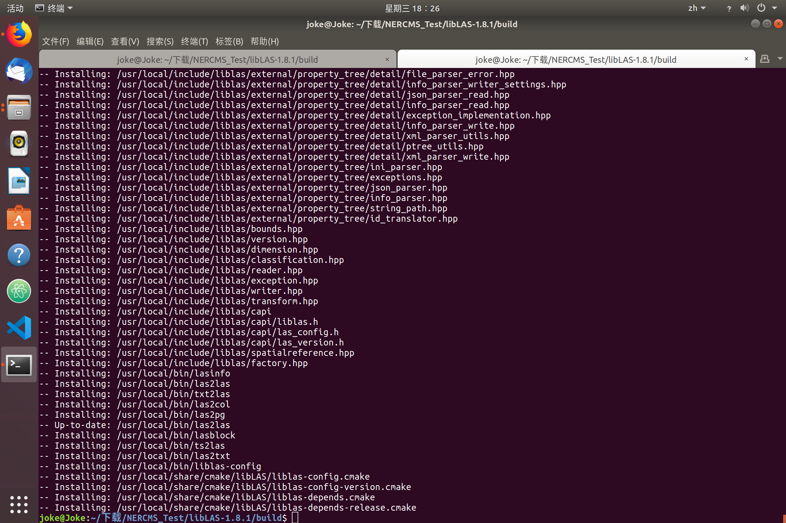
   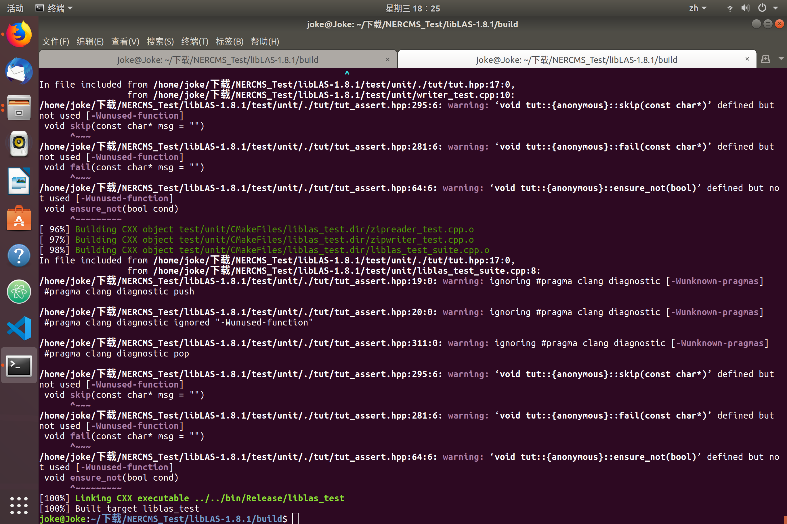

3. `make install`之后进行测试，选择的是安装包中自带的test文件进行测试。测试代码`lasinfo ../test/data/TO_core_last_clip.las`，结果失败了，lasinfo无法正常使用。
   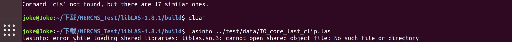

4. 解决方法是运行/sbin/ldconfig 文件来设置动态链接，可能是安装完成后一些设置工作还没有做，执行`sudo sh /sbin/ldconfig`，之后重新测试，成功。
   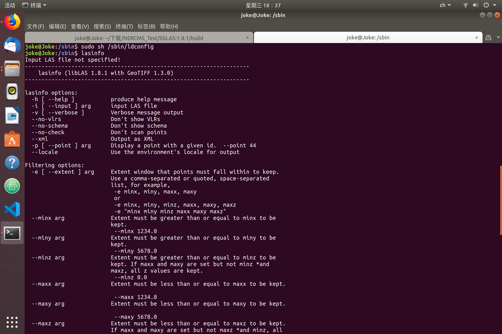
   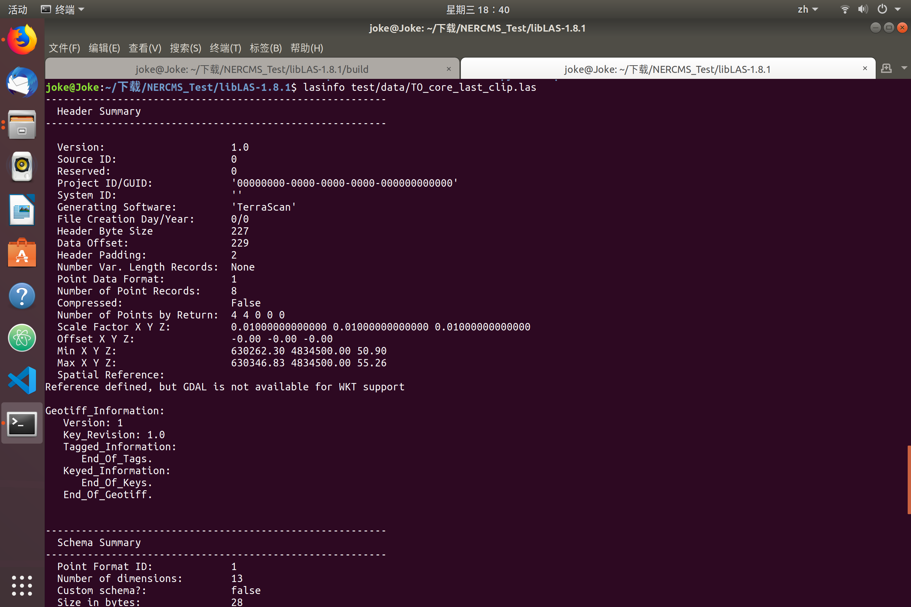
   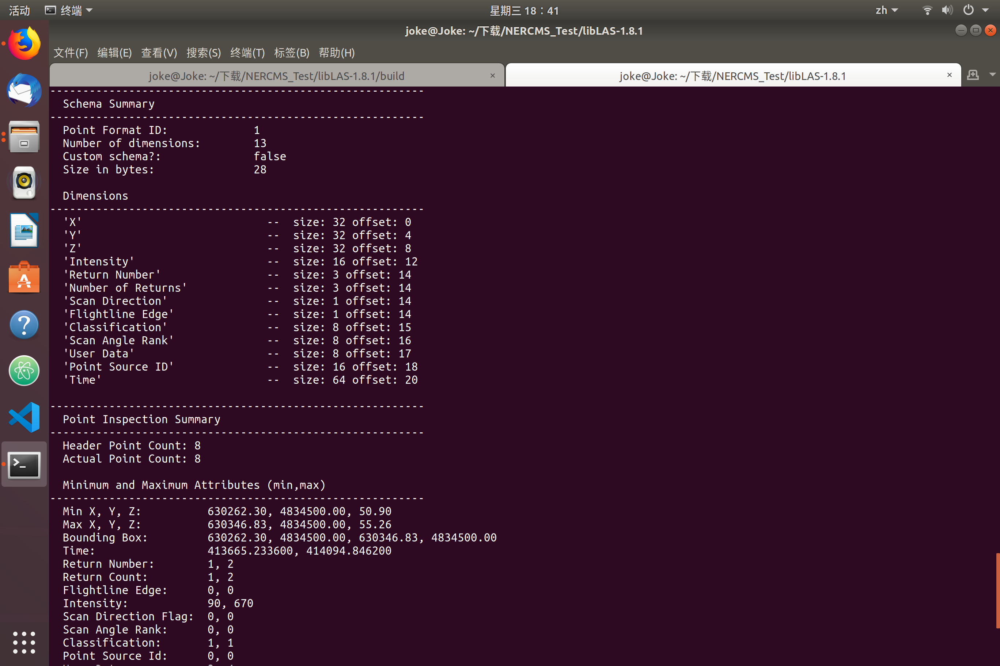
   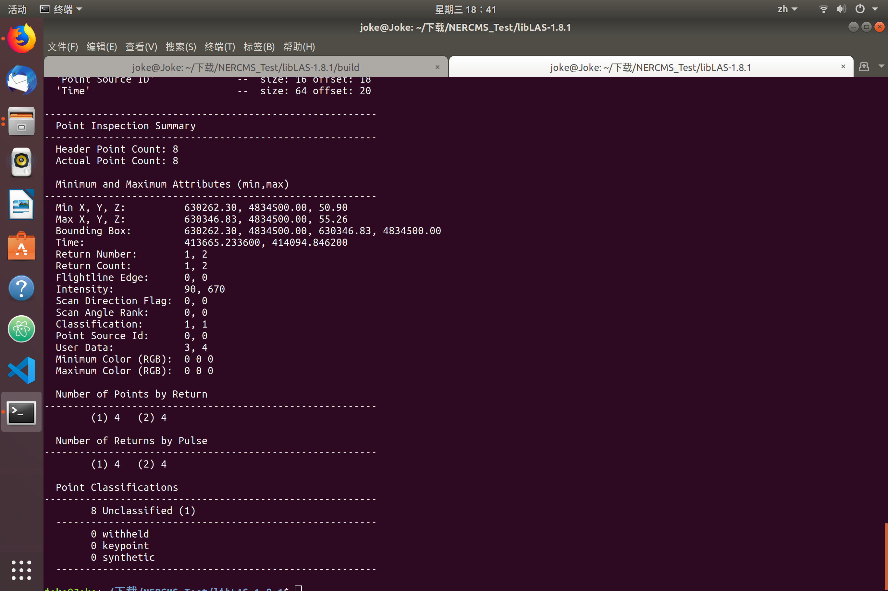

5. 安装好libLAS之后查看liblas.hpp的路径，我个人最终的路径应该是`/usr/local/include/liblas/liblas.hpp`
   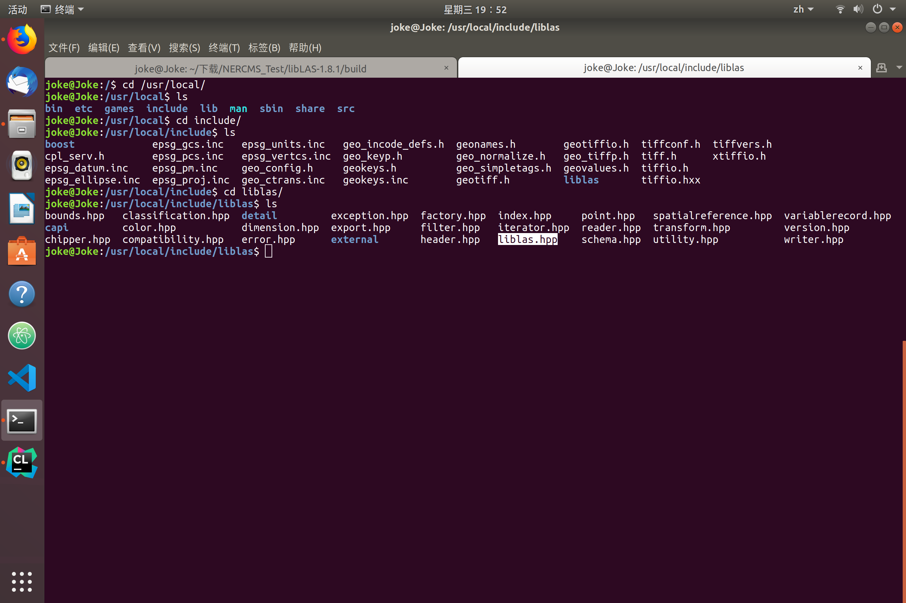

## 3.  查阅资料，安装 Jet Brains CLion ，使用 libLAS 编程确定 lidar.las 中 Variable Length Records 所占的字节大小，以及点云数据中包含点的总数目.

### 分析
1. 拿到这个问题，发现之前阅读的`LAS Specification 1.4 - R15`说明书前半部分还是有作用的。根据题目先安装`Jet Brains CLion`
   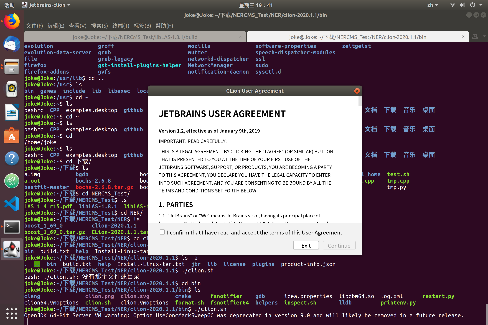

2. LAS文件构成:
   - Public Header Block
   - Variable Length Records(VLRs)
   - Point Data Records
   - Extended Variable Length Records(EVLRs)

3. LAS阅读时部分注释：
   - VLRs和EVLRs都是可选的，并没有一定会出现在文件中，这个可以根据PHB的内容进行判断
   - 所有的内容都是使用的小端编址
   - PDR（Point Data Record）的大小在一个文件内部必须是一样的（即必须采用0-10的某一种格式，这种格式也会在PHB中有所说明）
   - VLR的长度计算时有两部分组成，一部分是54bytes的VLRH（头部）以及后面的记录部分
   - 在使用XYZ的时候，先乘以比例尺并加上原点偏移距离之后才可以使用
   - 其他不是很重要还没记录

4. 要计算VLRs所占字节大小，这个由于PHB后面跟的就是VLR，可以通过查询`Header Size`获取VLR的起始位置，直接再在PHB中查看`Offset to Point Data`就可以知道VLRs部分后面的数据点开始处，也就是VLRs的结束位置，相当于拿到了起始以及结束的BYTES位置，相减即可算出VLRs的占空间大小
   
5. 至于点云数据中点的总数目，其实直接查看PHB中的`Number of Point Records`即可

### 解答

1. 在编写程序的时候由于不会使用libLAS库，稍微学了一下最为基础的内容读取，编写了较为简单的程序用于题目解答
   - 编写完毕简单的读取las头部内容的C++程序
   - 由于Clion使用的是cmake进行编译的，需要用到CmakeLists.txt进行规则描述，一开始不知道，直接就执行程序了，结果报了错全部是liblas库中未定义的引用
   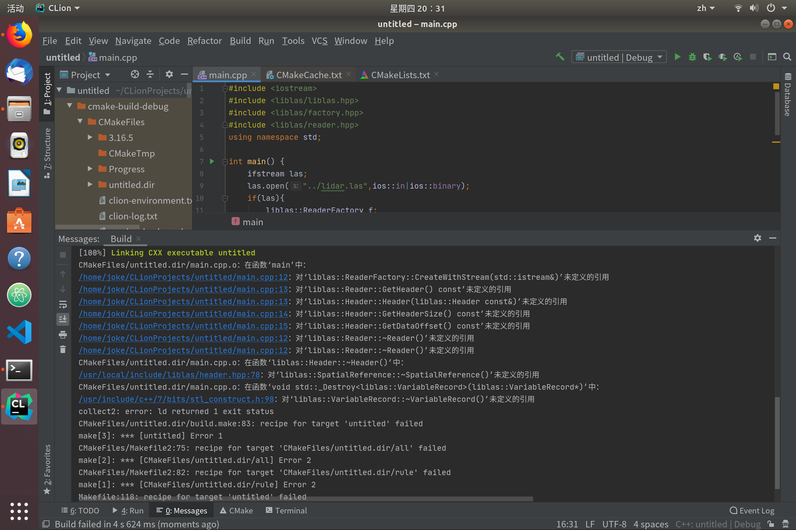

   - 找了半天问题后来才发现，直接虽然也可以调用liblas库中内容，但是在编译时莫名其妙会找不到库文件，必须要在cmakelist里面声明一下我们用的库，这里直接用的是`link_libraries("/usr/local/lib/liblas.so.2.4.0" )`，里面的路径是我自己liblas库的位置
   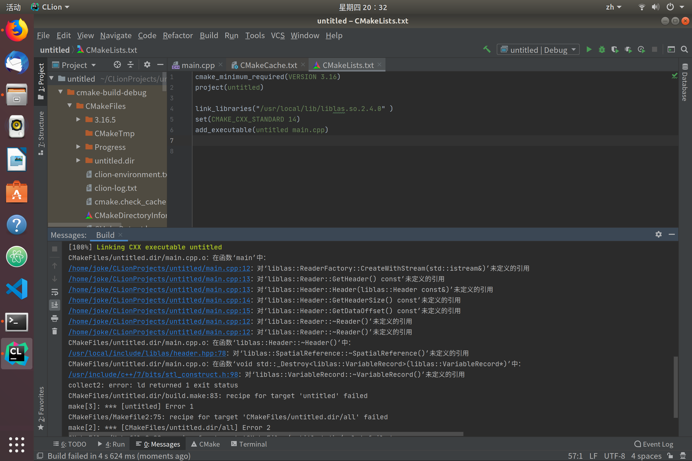
   
2. 之后就程序正常运行了，运行的结果如下，如图所示我们这个las里面应该是没有VLR格式的数据的，存在的点数一共是10100个
   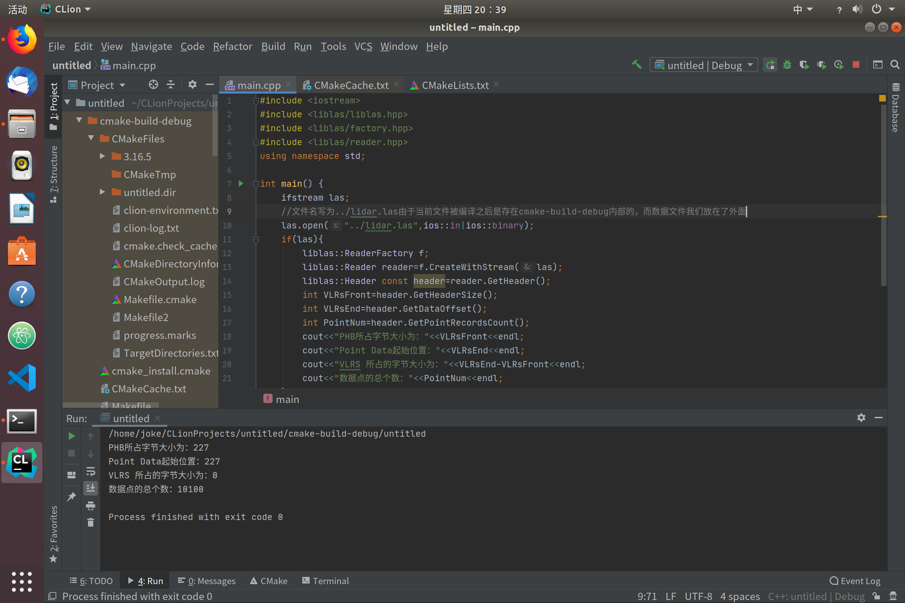
