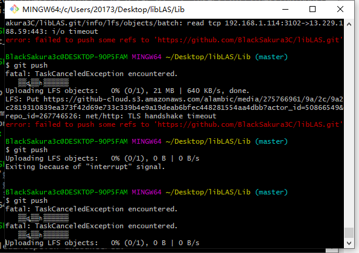

# LFS使用场景与使用说明

1. GitHub对于上传的文件大小有要求，单个文件不能大于100MB，当我们的工程里面有较大文件时，就需要用到LFS(large file storage)工具进行上传当不使用的时候，如果直接push会产生如下报错：

``` 
remote: Resolving deltas: 100% (3/3), completed with 2 local objects.
remote: error: GH001: Large files detected. You may want to try Git Large File Storage - https://git-lfs.github.com.
remote: error: Trace: b53d2c33593c43b5992f102ed66985cb
remote: error: See http://git.io/iEPt8g for more information.
remote: error: File Lib/boost_1_69_0.tar.gz is 106.54 MB; this exceeds GitHub's file size limit of 100.00 MB
To https://github.com/BlackSakura3C/libLAS.git
 ! [remote rejected] master -> master (pre-receive hook declined)
error: failed to push some refs to 'https://github.com/BlackSakura3C/libLAS.git'
```

2. LFS下载可以到官网下载，或者从本仓库的Lib/git-lfs-windows-v2.11.0.exe进行下载

3. 安装过程结束后，LFS管理是和每一个git账号绑定的，需要做一次初始化`git lfs install`
   
4. 在叙述后面的过程之前还是说一下不做这一步可能会出现的问题。如果之前已经把大文件add进来，已经完成了commit或者push操作，那要注意了：
   * 在做后续之前首先需要将commit取消掉，不然这次commit还是在git tree中的，可以考虑直接`git log`查看当前的commit记录历史，使用`git reset --hard commit_id`直接将本地的重置到这个id位置，特别说明的是，这个`reset --hard`是完全重置，可能你之前加入文件夹的内容也直接重置了，需要之前备份好(我个人平时也不直接把一份就当仓库了，所以重置后我是有备份的)‘
   * 完成上面所示相当于我们已经重回到加入大文件之前了，现在继续

5. 执行track操作，LFS文件管理是生成`.gitattributes`文件进行管理的，我们需要先把后续要加入的大文件告诉LFS管理器。使用`git lfs track "文件名or文件类型or直接放个目录(eg：test/)"`，完成后就会在当前目录下生成一份`.gitattributes`文件。需要注意的是track后面并不是要规定需要追踪文件在本地的路径，只是告诉系统要追什么文件即可，后面add的时候才需要注意`.gitattributes`文件和需要add的文件之间的路径关系。


6. 执行add操作，已经通过track跟踪了某个或某类文件了，现在只需要把需要增加的文件加入进来即可，我当时加入的文件就和`.gitattributes`在同一目录下，直接`git add .boost_1_69_0.tar.gz`即可


7. 之后就执行commit push操作即可
8. 由于这个网速原因……推荐大家早上上传，感觉还挺快的，大晚上我还真传不上去，一开始以为LFS服务器必须挂节点，后来早上直接直连上传ok了

